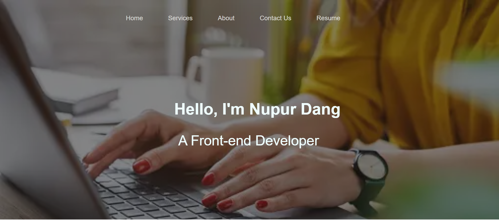
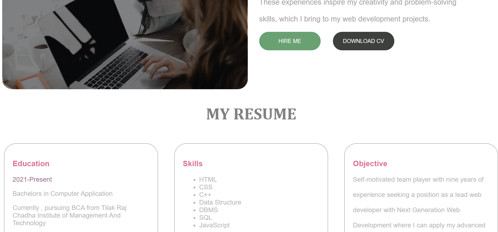

# Myportfolio
## Table of contents
1. [website html code](frontpage.html)
2. [css code](mycssused.css)

## HTML Code Used

* Here is the frontpage view of my website
 <!--  -->
 

* Here's my html code for website


```html

<!DOCTYPE html>
<html lang="en">

<head>
    <meta charset="UTF-8">
    <meta name="viewport" content="width=device-width, initial-scale=1.0">
    <title>My Portfolio</title>
    <link rel="stylesheet" href="upper.css">
    <link rel="shortcut icon" href="faviconportfolio.ico" type="image/x-icon">
</head>

<body>
    <div class="container">
        <div class="backeffect">
            <div class="nav">
                <nav class="navigate">

                    <ul>
                        <li><a href="">Home</a></li>
                        <li><a href="">Services</a></li>
                        <li><a href="">About </a></li>
                        <li><a href="">Contact Us</a></li>
                        <li><a href="">Resume</a></li>
                    </ul>
                    <!-- <div class="search">
                     <label for="Search">Search your Destinations</label> -->
                    <!-- <input type="text" name="Search" id="" placeholder=" Search for Your fav Tourist Places">
    
                    <button class="btn">SEARCH</button>
                </div> -->
                </nav>

            </div>
            <div class="content">
                <h2 id="head"> Hello, I'm Nupur Dang</h2>
                <p id="para">A Front-end Developer</p>
            </div>

        </div>
    </div>
    <div class="bio">
        <div class="biophoto">
            <div class="bioeffect">

            </div>
        </div>
        <div class="biocontent">
            <!-- <h2>MY BIO</h2> -->
            <br>
            <p>Hi, I'm <b>Nupur, a frontend web developer </b> with a strong <br> <br>passion for creating immersive and
                user-friendly web<br> <br> experiences.I specialize in HTML, CSS,and JavaScript, and <br> <br>have
                hands-on experience with popular frontend frameworks <br> <br> like React and Angular.I am dedicated to
                continuous learning <br> <br>andstaying up-to-date with the latest frontend technologies <br> <br>and
                best practices. In my free time, I enjoy exploring new <br> <br>hiking trails and experimenting with new
                recipes in the kitchen. <br><br> These experiences inspire my creativity and problem-solving<br> <br>
                skills, which I bring to my web development projects. <br> <br><button id="hireme" type="button">HIRE
                    ME</button>
                <button id="downloadcv" type="button">DOWNLOAD CV</button>
            </p>


        </div>
    </div>
    <h2 id="resumehead">MY RESUME</h2>
    <div class="myresume">
        
        
        <div class="education">
            <h3>Education</h3>
            <div class="year">
                <p>2021-Present</p>
            </div>
            <div class="degree">
                <p>Bachelors in Computer Application</p>
            </div>
            <div class="eduplace">
                <p>Currently , pursuing BCA from Tilak Raj Chadha Institute of Management And Technology</p>
            </div>
            <hr>
            <div class="year">
                <p>2019-20</p>
            </div>
            <div class="degree">
                <p>Higher Senior Secondary</p>
            </div>
            <div class="eduplace">
                <p>Swami Vivekanand Public School,Jagadhri</p>
                <p>Percentage - 93.8%</p>
            </div>
        </div>
        <div class="skills">
            <h3>Skills</h3>
            <p><ul>
                <li>HTML</li>
                <li>CSS</li>
                <li>C++</li>
                <li>Data Structure</li>
                <li>DBMS</li>
                <li>SQL</li>
                <li>JavaScript</li>
            </ul></p>
            <hr>
            <h3>Languages</h3>
            <p>English</p>
            <p>Hindi</p>
        </div>
        <div class="objective">
            <h3>Objective</h3>
            <p>Self-motivated team player with nine years of<br><br> experience seeking a position as a lead web <br><br> developer with Next Generation Web <br><br> Development  where I can  apply my advanced <br><br>knowledge   of web design with my leadership <br><br>abilities to meet client needs and exceed their <br><br>expectations.</p>
        </div>
    </div>
    <div class="freelance">
        <p id="freelancecontent">Please contact for queries</p>
        <button  id="freelancebtn" type="button">CONTACT ME</button>
    </div>
    <div class="contactme">
        
            <div class="contactform">
                <div class="contacteffect">
                <caption>Send a Message</caption><br><br>
                <form action="">
                    <input type="text" placeholder="Name*"><br><br>
                    <input type="email" placeholder="E-mail*"><br> <br>
                    <!-- <input type="text" id="textarea" placeholder="Type Your Message" > -->
                    <textarea name="Message" id="" cols="30" rows="10" placeholder="Type Your Message"></textarea><br><br>
                    <button class="formbtn" type="button">SEND MESSAGE</button>
                </form>
            </div>
        </div>
    </div>
    <footer>
    <div class="footerdata">
        <h4>Get in Touch</h4>
        <br>
        <p class="getdata"> &#9743; Phone: 805864239</p>
        <!-- <p class="putdata">789093735</p> -->
        <p class="getdata"> &#9993; E-mail: nupurdang@.com</p>
        <!-- <p class="putdata">nupurdang@.com</p> -->
        <p class="getdata">&#127968; Address: xyz lane, Haryana, India</p>
        <!-- <p class="putdata">xyz lane, Haryana, India</p> -->

    </div>
    <div class="services">
        <h4>Services</h4>
        <br>
        <p>Web Design</p>
        <p>E-commerce Sites</p>
        <p>Front-end</p>
        
    </div>
    <div class="navagation">
        <h4>Navagation</h4>
        <br>
        <p>HTML</p>
        <p>CSS</p>
        <p>JavaScript</p><br><br>
        <div class="lastline">
            <p>Copyright ©2023 All rights reserved | <br>This website is made by Nupur</p>
        </div>
    </div>
</footer>


</body>

</html>


```

## CSS Code

* Here's a Preview of my website



* Here's the CSS code

```


.container{
    background-image: url('https://media.istockphoto.com/id/1254993875/photo/cropped-image-of-business-woman-hand-working-laptop-computer-in-home-office.webp?b=1&s=170667a&w=0&k=20&c=knBGipYVyUge-Kjp6i_X-gP44HNPsd7GsIZ5hqx98Y8=');
    height: 550px;
    width: 1256px;
    background-size: cover;
    background-repeat: no-repeat;
    /* background-color: black; */
   
}
.backeffect{
    width: 1256px;
    height: 550px;
    background-color:  rgba(10, 12, 13, 0.5);;
}
nav {
    display: flex;
}
nav ul li {
    list-style: none;
    padding: 0 24px;
    /* margin-left: 40px; */
}

nav ul li a {
    color: rgb(222, 222, 217);
    text-decoration: none;
    /* justify-content: center; */
    font-family: sans-serif;
    margin-left: 15px;
    /* margin-right: 40px; */
}

nav ul li a:hover {
    color: rgb(124, 142, 7);
    font-weight: bolder;
}

nav ul {
    display: flex;
    justify-content: flex-start;
    height: 58px;
    align-items: center;
}

.navigate {
    height: 50px;
    /* background-color: rgb(191, 4, 4); */
    color: aliceblue;
    margin-left: 240px;
}

.navitems a {
    /* background-color: rgb(191, 4, 4); */
    margin: 15px;
    color: aliceblue;
    text-decoration: none;
}
.content{
    color: azure;
    font-family: Arial, Helvetica, sans-serif;
    margin-left: 350px;
    margin-top: 200px;
    /* font-size: 40px; */
}
#head{
    font-size:40px ;
    /* margin-left: 90px; */
}
#para{
    font-size: 35px;
    margin-left: 100px;
}
.biophoto{
    background-image: url('https://images.unsplash.com/photo-1491975474562-1f4e30bc9468?ixlib=rb-4.0.3&ixid=M3wxMjA3fDB8MHxzZWFyY2h8NDJ8fGdpcmwlMjB3b3JraW5nJTIwb24lMjBsYXB0b3B8ZW58MHx8MHx8fDA%3D&auto=format&fit=crop&w=600&q=60');
    background-size: cover;
    height: 600px;
    background-repeat: no-repeat;
    display: flex;
    width: 600px;
    border-radius: 25px;
}

.biocontent{
    width: 500px;
    height:550px ;
    display: flex;
    margin: 28px;
    /* padding: 20px; */
    font-family: sans-serif;
    font-size: 18px;
    color: rgb(164, 160, 160);
}
.bio{
    display: flex;
    margin: 15px;
    margin-top: 70px;
}
.bioeffect{
    width: 599px;
    height: 600px;
    border-radius: 35px;
    background-color:  rgba(10, 12, 13, 0.5);
}
#hireme{
    cursor: pointer;
    color: rgb(246, 246, 246);
    background-color: rgb(105, 161, 115);
    padding: 15px;
    border-radius: 25px;
    width: 150px;
    border: 0px;
}
#downloadcv{
    cursor: pointer;
    color: rgb(246, 246, 246);
    background-color: rgb(62, 64, 62);
    padding: 15px;
    border-radius: 25px;
    width: 150px;
    margin-left: 25px;
    border: 0px;
}
.myresume{
    display: flex;
    font-family:Arial, Helvetica, sans-serif ;
    color: rgb(182, 181, 181);
}
.objective{
    width: 400px;
   margin:20px;
   border: 0.4px solid gray;
   padding: 20px;
   border-radius: 30px;
}
.skills{
    width: 400px;
    margin:20px;
    border: 0.4px solid gray;
    border-radius: 30px;
    padding: 20px;
}
.education{
    width: 400px;
    margin: 20px;
    border: 0.4px solid gray;
    border-radius: 30px;
    padding: 20px;
}
h2{
    margin-left: 90px;
    /* color: grey; */
    /* font-family: 'Segoe UI', Tahoma, Geneva, Verdana, sans-serif; */
}
h3{
    color: palevioletred;
}
#resumehead{
    color: grey;
    font-family: Cambria, Cochin, Georgia, Times, 'Times New Roman', serif;
    text-align: center;
    margin: 30px;
    font-size: 40px;
}
.year{
    color: rgb(155, 106, 135);
}
.freelance{
    background-image: url('https://images.unsplash.com/photo-1518674660708-0e2c0473e68e?ixlib=rb-4.0.3&ixid=M3wxMjA3fDB8MHxzZWFyY2h8NDB8fG1lc3NhZ2V8ZW58MHx8MHx8fDA%3D&auto=format&fit=crop&w=600&q=60');
    height: 220px;
    background-size: cover;
    color: palevioletred;
    font-size: 60px;
    text-align: center;
    /* padding-top: 30px; */
    /* display: inline-block; */
    border-radius: 50px;
}
#freelancebtn{
    background-color: palevioletred;
    /* margin-top: 30px; */
    padding: 15px;
    border-radius: 20px;
    width: 230px;
    border: 0px;
    cursor: pointer;
    color: aliceblue;
    font-size: 16px;
    /* margin-bottom: 15px; */
}
#freelancecontent{
    padding-top: 30px;
    padding-bottom: 0px;
    /* display: inherit; */
   /* block-size: fit-content; */
   /* max-height: fit-content; */
   height: 45px;
}
.contactme{
   /* background-image: url('https://images.unsplash.com/photo-1524661135-423995f22d0b?ixlib=rb-4.0.3&ixid=M3wxMjA3fDB8MHxzZWFyY2h8MjF8fGdvb2dsZSUyMG1hcHN8ZW58MHx8MHx8fDA%3D&auto=format&fit=crop&w=600&q=60'); */
   height: 600px;
   background-repeat: no-repeat;
   margin-top: 70px;
   background-size: cover;
}
.contacteffect{
    /* background-color:    rgba(20, 20, 21, 0.2); */
    height: 450px;
    width: 1100px;
    border-radius: 20px;
    /* margin-left: 40px; */
    /* margin-top: 40px; */
}
    /* background-color:    rgba(232, 236, 237, 0.5);; */


.contactform{
    background-image: url('https://images.unsplash.com/photo-1518674660708-0e2c0473e68e?ixlib=rb-4.0.3&ixid=M3wxMjA3fDB8MHxzZWFyY2h8NDB8fG1lc3NhZ2V8ZW58MHx8MHx8fDA%3D&auto=format&fit=crop&w=600&q=60');
    height: 450px;
    border: 0.3px solid  rgb(155, 15, 76);
    background-color: whitesmoke;
   width: 1100px;
   padding: 20px;
   text-align: center;
   font-size: 25px;
   font-family: 'Lucida Sans', 'Lucida Sans Regular', 'Lucida Grande', 'Lucida Sans Unicode', Geneva, Verdana, sans-serif;
    /* display: inline; */
   /* margin: 30px; */
   margin-left: 40px;
   margin-top: 40px;
   border-radius: 20px;
   /* color: rgb(135, 32, 77); */
   color: palevioletred;
   font-weight: bolder;
   background-repeat: no-repeat;
   background-size: cover;
}
input{
    width: 360px;
    height: 30px;
    /* border-bottom: ; */
    border-color: plum;

}
textarea{
    width: 360px;
    height: 100px;
    padding-top: 0%;
    padding-bottom: 40px;
    border-color: plum;
    /* padding-top: 0%; */
}
.formbtn{
    background-color: palevioletred;
    /* margin-top: 30px; */
    padding: 15px;
    border-radius: 20px;
    width: 230px;
    border: 0px;
    cursor: pointer;
    color: aliceblue;
    font-size: 16px;
}
footer{
    height: 300px;
    background-color: rgba(229, 229, 229, 0.912);
    padding: 50px;
    font-family: Arial, Helvetica, sans-serif;
    color: gray;
    display: flex;
}
h4{
    color: palevioletred;
    font-size: 20px;
}
.services{
    margin-left: 250px;
}
.navagation{
    margin-left: 200px;
}


```


